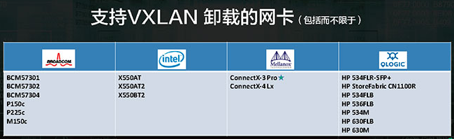
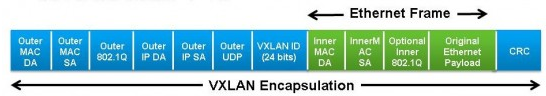
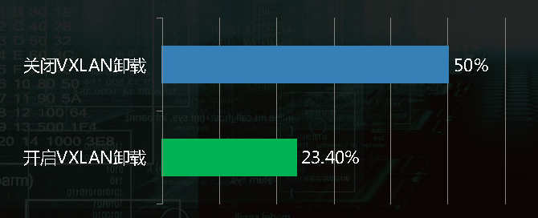

# 一、介绍

## **1.1 offload技术概述**

首先要从术语offload说起，offload指的是将一个本来有软件实现的功能放到硬件上来实现，这样就可以将本来在操作系统上进行的一些数据包处理（如分片、重组等）放到网卡硬件上去做，降低系统CPU消耗的同时，提高处理性能。在neutron中，基于VXLAN的网络虚拟技术给服务器的CPU带来了额外的负担，比如封包、解包和校验等，VXLAN的封包和解包都是由OVS来完成的，使用VXLAN offload技术后，VXLAN的封包和解包都交给网卡或者硬件交换机来做了，那么网卡的VXLAN offload技术就是利用网卡来实现VXLAN的封包和解包功能。

再说技术分类，实现offload的几种技术：

- LSO（Large Segment Offload）：协议栈直接传递打包给网卡，由网卡负责分割
- LRO（Large Receive Offload）：网卡对零散的小包进行拼装，返回给协议栈一个大包
- GSO（Generic Segmentation Offload）：LSO需要用户区分网卡是否支持该功能，GSO则会自动判断，如果支持则启用LSO，否则不启用
- GRO（Generic Receive Offload）：LRO需要用户区分网卡是否支持该功能，GRO则会自动判断，如果支持则启用LRO，否则不启用
- TSO（TCP Segmentation Offload）：针对TCP的分片的offload。类似LSO、GSO，但这里明确是针对TCP
- USO（UDP Segmentation offload）：正对UDP的offload，一般是IP层面的分片处理

###  **几种技术的对比**

（1）LSO vs LRO
两种技术分别对应发送数据和接收数据两个方面
一般来说，计算机网络上传输的数据基本单位是离散的数据包，而且这个数据包都有MTU的大小的限制，如果需要 发送比较多的数据，那么经过OS协议栈的时候，就会拆分为不超过MTU的数据包，如果使用CPU来做的话，会造成使用率过高。
引入LSO后，在发送数据超过MTU的时候，OS只需要提交一次请求给网卡，网卡会自动把数据拿过来，然后进行拆分封装，发送的数据包不会超过MTU的限制，而LRO的作用就是当网卡一次收到很多碎片数据包时，LRO可以辅助自动组合成一段较大的数据包，一次性的交给OS处理，这两种技术主要面向TCP报文。
（2）TSO vs UFO
分别对应TCP报文和UDP报文，TSO 将 TCP 协议的一些处理下放到网卡完成以减轻协议栈处理占用 CPU 的负载。通常以太网的 MTU 是1500Bytes，除去 IP 头（标准情况下20Bytes）、TCP头（标准情况下20Bytes），TCP的MSS (Max Segment Size)大小是1460Bytes。当应用层下发的数据超过 MSS 时，协议栈会对这样的 payload 进行分片，保证生成的报文长度不超过MTU的大小。但是对于支持 TSO/GSO 的网卡而言，就没这个必要了，可以把最多64K大小的 payload 直接往下传给协议栈，此时 IP 层也不会进行分片，一直会传给网卡驱动，支持TSO/GSO的网卡会自己生成TCP/IP包头和帧头，这样可以offload很多协议栈上的内存操作，checksum计算等原本靠CPU来做的工作都移给了网卡。


##  **1.2 NIC的VXLAN offload技术介绍**

 上面主要介绍了一些offload技术的基本概念，下面来详细介绍VXLAN的offload原理。
  在虚拟化的网络覆盖应用中存在多种技术，主要包括VXLAN、NVGRE和SST等隧道技术，以VXLAN技术为例，采用MAC-in-UDP来进行数据包的转换传输，从上图可以看出，除了UDP协议报头，VXLAN还引入额外的数据包处理，这种添加或者移除协议包头的操作使CPU需要执行关于数据包的更多操作。目前来看，Linux driver已经可满足硬件网卡的VXLAN offload需求，使用下面的ethtool命令就可以配置网卡的VXLAN offload功能


  ```
  ethtool -k ethX //这项命令可以列举出ethX的offloads以及当前的状态
  ```

  ```
  ethtool -K ethX tx-udp_tnl-segmentation [off|on] //可以开启或关闭Linux
  ```



  采用网卡VXLAN offload技术后，overlay情形下的虚拟网络性能也会得到大规模的提升。本质上来说，VXLAN的封装格式类似于一种l2vpn技术，即将二层以太网报文封装在udp报文里，从而跨越underlay L3网络，来实现不同的服务器或不同的数据中心间的互联。

  在采用VXLAN技术后，由于虚机产生或接受的报文被封装于外层的UDP报文中予以传输，使得以往的TCP segment optimization、TCP checksum offload等功能对于内层的虚机的TCP数据收发失效，较大的影响了虚机间通信的性能，给最终的用户带来了很差的用户体验。厂商为了解决上述问题，提出了NIC VXLAN offload技术。

  网卡的VXLAN offload主要对网卡的能力进行了增强，并与网卡驱动配合，使得网卡能够知晓VXLAN内部以太报文的位置，从而使得TSO、TCP checksum offload这些技术能够对内部的以太报文生效，从而提升TCP性能。



  目前部署虚拟网络主流采用VXALN技术，其封包、解包用CPU来实现，将会消耗很大的CPU等系统资源。VXLAN使用通用的x86进行封包、解包处理，其CPU资源占用会达到50%左右，可以考虑使用支持VXLAN offload功能的网卡来降低系统资源的消耗问题。目前来看，博通、Intel、mellanox和Qlogic等网卡厂商都支持VXLAN的卸载。尽管是不同厂商的产品，但业内已经有标准的VXLAN offload接口，无需改动代码即可启用这一功能，并不会增加代码层面的工作量。


