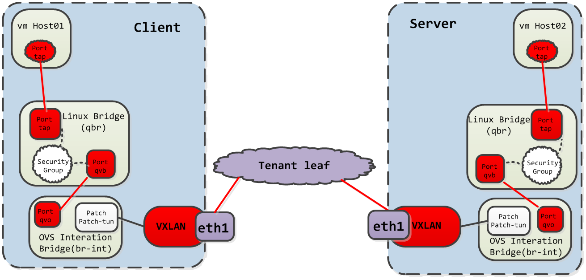

# 三、 VXLAN offload性能验证

--------

####  **特别说明：由于目前实际生产环境的网卡不具备VXLAN的offload功能，所以无法进行对比性能测试，该验证部分主要是对不启动VXLAN offload功能的方案进行性能测试，后续如果环境满足再进行对比分析验证。**


## **3.1 测试环境介绍**

| Client Node               | Server Node                                                                                                  | 
| ------------------------  | ----------------------------------------------------------------------------------------------------------   | 
|  2 interl CPU v3 @2.50HZ  |2 interl CPU v3 @2.50HZ                                                                                       |
|  256GB RAM                |  256GB RAM                                                                                                   |
|NIC                        |  NIC                                                                                                         |
|CentOS 7                   | CentOS 7                                                                                                     |


| Traffic Flow Type         | Data Path                                                                                                    | 
| --------------------------| ----------------------------------------------------------------------------------------------------------   | 
|VXLAN-to-VXLAN over bridge | client host -> linux bridge -> br-int -> eth1 -> leaf switch -> eth1 -> br-int -> linux bridge -> server host|   


#### **整体原理框图**



## **3.2 测试验证步骤**

Netperf工具主要用来产生客户端和服务端的TCP流量，它是测试网络的一个轻量级的用户进程，主要包括以下部分：

Netperf---用户级进程，用来连接服务端并产生流量

Netserver---用户级进程，用来监听个接受请求连接。


查看offload信息

```
[yuchenghui@localhost vxlan-offload]$ ethtool -k eno16777736
Features for eno16777736:
rx-checksumming: off
tx-checksumming: on
        tx-checksum-ipv4: off [fixed]
		tx-checksum-ip-generic: on
        tx-checksum-ipv6: off [fixed]
		tx-checksum-fcoe-crc: off [fixed]
		tx-checksum-sctp: off [fixed]
scatter-gather: on
        tx-scatter-gather: on
		tx-scatter-gather-fraglist: off [fixed]
tcp-segmentation-offload: on
        tx-tcp-segmentation: on
		tx-tcp-ecn-segmentation: off [fixed]
		tx-tcp6-segmentation: off [fixed]
udp-fragmentation-offload: off [fixed]
generic-segmentation-offload: on
generic-receive-offload: on
large-receive-offload: off [fixed]
rx-vlan-offload: on
tx-vlan-offload: on [fixed]
ntuple-filters: off [fixed]
receive-hashing: off [fixed]
highdma: off [fixed]
rx-vlan-filter: on [fixed]
vlan-challenged: off [fixed]
tx-lockless: off [fixed]
netns-local: off [fixed]
tx-gso-robust: off [fixed]
tx-fcoe-segmentation: off [fixed]
tx-gre-segmentation: off [fixed]
tx-ipip-segmentation: off [fixed]
tx-sit-segmentation: off [fixed]
tx-udp_tnl-segmentation: off [fixed]  //该选项的状态代表着网卡的VXLAN offload功能
tx-mpls-segmentation: off [fixed]
fcoe-mtu: off [fixed]
tx-nocache-copy: off
loopback: off [fixed]
rx-fcs: off
rx-all: off
tx-vlan-stag-hw-insert: off [fixed]
rx-vlan-stag-hw-parse: off [fixed]
rx-vlan-stag-filter: off [fixed]
busy-poll: off [fixed]

```


可以看到启动VXLAN offload功能的tx-udp_tnl-segmentation带有[fixed]，意味这VXLAN的offload功能不可用，那就先默认该功能关闭测试一下目前状态的性能如何。

验证测试：

Netperf主要用来获取client端和server端的throughput和CPU的利用率，测试性能也主要集中在这两个方面，该测试内容主要是用于测试连接网桥的eth网卡的VXLAN offload功
能（由于不可修改，只能先测下默认关闭状态的性能）

本次验证的shell测试脚本如下所示：

[TCP stream testing](https://github.com/chenghuiyu/VxLAN-offload-shell/blob/master/netperf_tcp_stream.sh)

[UDP stream testing](https://github.com/chenghuiyu/VxLAN-offload-shell/blob/master/netperf_udp_stream.sh)

## **3.3 测试结果分析**


netperf raw results(VXLAN offload Off)：


```
MIGRATED TCP STREAM TEST from 0.0.0.0 (0.0.0.0) port 0 AF_INET to 192.168.118.175 () port 0 AF_INET : +/-2.500% @ 99% conf.
!!! WARNING
!!! Desired confidence was not achieved within the specified iterations.
!!! This implies that there was variability in the test environment that
!!! must be investigated before going further.
!!! Confidence intervals: Throughput      : 2.544%
!!!                       Local CPU util  : 7.108%
!!!                       Remote CPU util : 0.706%

Recv   Send    Send                          Utilization       Service Demand
Socket Socket  Message  Elapsed              Send     Recv     Send    Recv
Size   Size    Size     Time     Throughput  local    remote   local   remote
bytes  bytes   bytes    secs.    10^6bits/s  % S      % S      us/KB   us/KB
 87380  16384  16384    10.01      3919.03   27.46    99.61    0.574   2.082
MIGRATED TCP STREAM TEST from 0.0.0.0 (0.0.0.0) port 0 AF_INET to 192.168.118.175 () port 0 AF_INET : +/-2.500% @ 99% conf.
!!! WARNING
!!! Desired confidence was not achieved within the specified iterations.
!!! This implies that there was variability in the test environment that
!!! must be investigated before going further.
!!! Confidence intervals: Throughput      : 52.356%
!!!                       Local CPU util  : 37.299%
!!!                       Remote CPU util : 11.407%

Recv   Send    Send                          Utilization       Service Demand
Socket Socket  Message  Elapsed              Send     Recv     Send    Recv
Size   Size    Size     Time     Throughput  local    remote   local   remote
bytes  bytes   bytes    secs.    10^6bits/s  % S      % S      us/KB   us/KB

 87380  16384   4096    ------------------------------------
/usr/local/bin/netperf -l 15 -H 192.168.118.175 -t TCP_STREAM -i 10,2 -I 99,5 -c -C -- -m 8192 -s 32768 -S 32768

MIGRATED TCP STREAM TEST from 0.0.0.0 (0.0.0.0) port 0 AF_INET to 192.168.118.175 () port 0 AF_INET : +/-2.500% @ 99% conf. 
!!! WARNING
!!! Desired confidence was not achieved within the specified iterations.
!!! This implies that there was variability in the test environment that
!!! must be investigated before going further.
!!! Confidence intervals: Throughput      : 2.030%
!!!                       Local CPU util  : 5.593%
!!!                       Remote CPU util : 1.878%

Recv   Send    Send                          Utilization       Service Demand
Socket Socket  Message  Elapsed              Send     Recv     Send    Recv
Size   Size    Size     Time     Throughput  local    remote   local   remote
bytes  bytes   bytes    secs.    10^6bits/s  % S      % S      us/KB   us/KB

 65536  65536   8192    15.00      2205.32   37.64    26.85    1.398   0.997  

------------------------------------

/usr/local/bin/netperf -l 15 -H 192.168.118.175 -t TCP_STREAM -i 10,2 -I 99,5 -c -C -- -m 32768 -s 32768 -S 32768

MIGRATED TCP STREAM TEST from 0.0.0.0 (0.0.0.0) port 0 AF_INET to 192.168.118.175 () port 0 AF_INET : +/-2.500% @ 99% conf. 
Recv   Send    Send                          Utilization       Service Demand
Socket Socket  Message  Elapsed              Send     Recv     Send    Recv
Size   Size    Size     Time     Throughput  local    remote   local   remote
bytes  bytes   bytes    secs.    10^6bits/s  % S      % S      us/KB   us/KB

 65536  65536  32768    15.00      2254.21   34.11    29.88    1.240   1.086  
------------------------------------

/usr/local/bin/netperf -l 15 -H 192.168.118.175 -t TCP_STREAM -i 10,2 -I 99,5 -c -C -- -m 4096 -s 8192 -S 8192

MIGRATED TCP STREAM TEST from 0.0.0.0 (0.0.0.0) port 0 AF_INET to 192.168.118.175 () port 0 AF_INET : +/-2.500% @ 99% conf. 
!!! WARNING
!!! Desired confidence was not achieved within the specified iterations.
!!! This implies that there was variability in the test environment that
!!! must be investigated before going further.
!!! Confidence intervals: Throughput      : 6.687%
!!!                       Local CPU util  : 4.489%
!!!                       Remote CPU util : 7.536%

Recv   Send    Send                          Utilization       Service Demand
Socket Socket  Message  Elapsed              Send     Recv     Send    Recv
Size   Size    Size     Time     Throughput  local    remote   local   remote
bytes  bytes   bytes    secs.    10^6bits/s  % S      % S      us/KB   us/KB

 16384  16384   4096    15.00       649.39   25.35    20.87    3.200   2.632  
------------------------------------

/usr/local/bin/netperf -l 15 -H 192.168.118.175 -t TCP_STREAM -i 10,2 -I 99,5 -c -C -- -m 8192 -s 8192 -S 8192

MIGRATED TCP STREAM TEST from 0.0.0.0 (0.0.0.0) port 0 AF_INET to 192.168.118.175 () port 0 AF_INET : +/-2.500% @ 99% conf. 
!!! WARNING
!!! Desired confidence was not achieved within the specified iterations.
!!! This implies that there was variability in the test environment that
!!! must be investigated before going further.
!!! Confidence intervals: Throughput      : 77.405%
!!!                       Local CPU util  : 64.518%
!!!                       Remote CPU util : 65.019%

Recv   Send    Send                          Utilization       Service Demand
Socket Socket  Message  Elapsed              Send     Recv     Send    Recv
Size   Size    Size     Time     Throughput  local    remote   local   remote
bytes  bytes   bytes    secs.    10^6bits/s  % S      % S      us/KB   us/KB

 16384  16384   8192    15.00       399.66   61.77    70.47    14.942  16.917 
```


